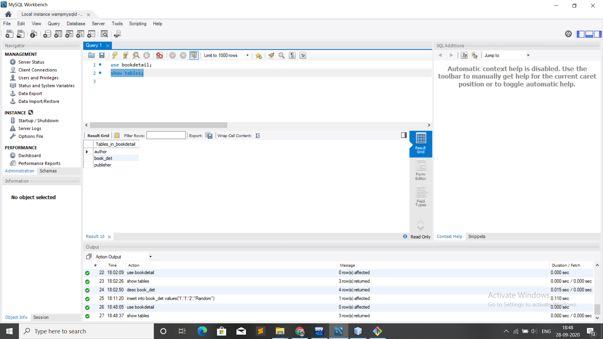
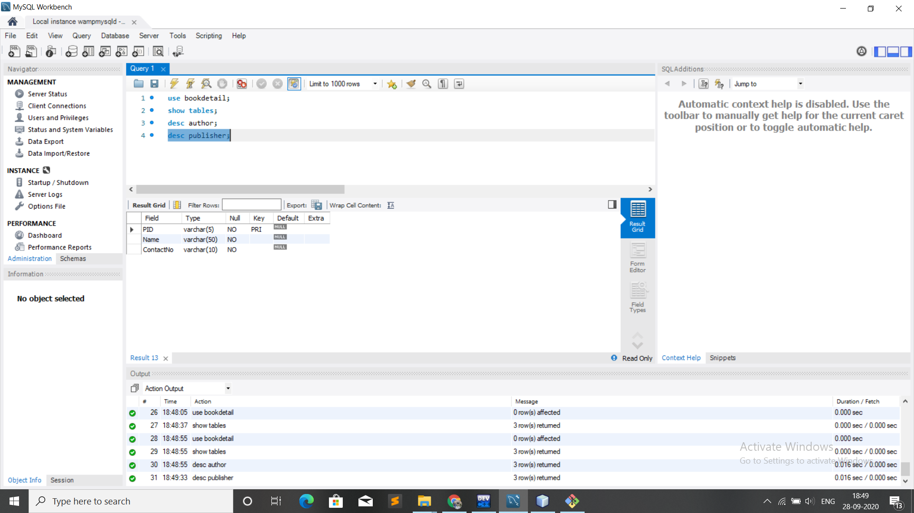
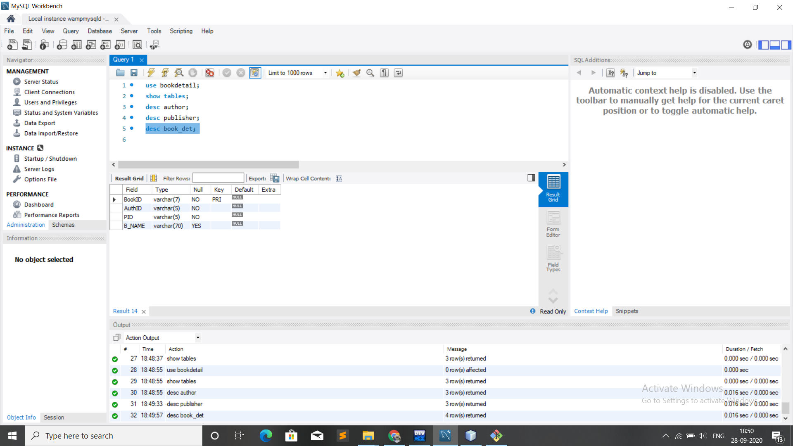
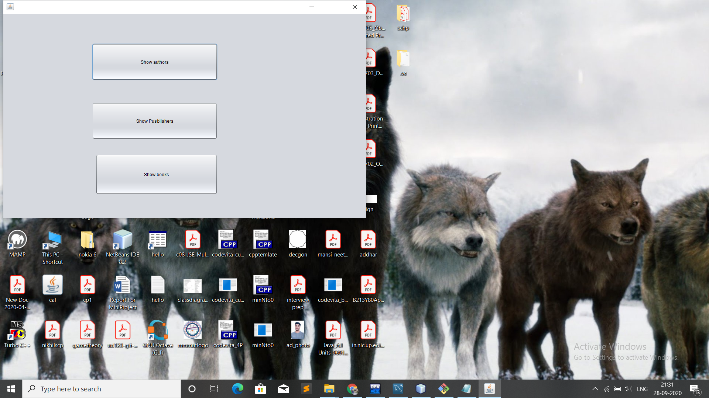
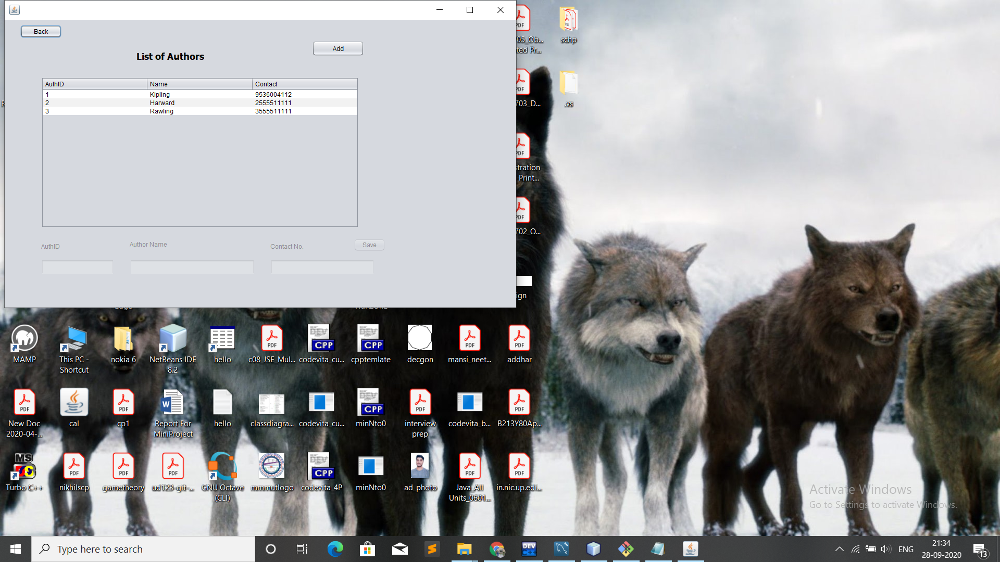
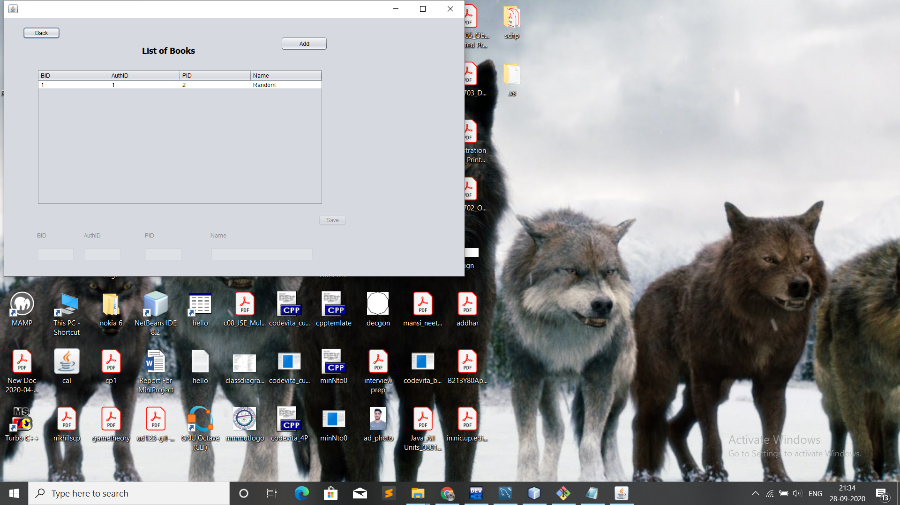

# LIBRARY-PROTOTYPE
It is protoype  of application for managing details of authors, publishers and books at library. 

This application uses MySQL database; 
There are total three table used in this prototype which is as follows:   

 
1)Two master(Data is rarely change) tables: 
 a)Author Detail 
 
  
 b)Publisher Table 
 
    
 2)And one Transaction table Book_det for addition and deletion of book. 
 
  
 Java GUI interface is used for managing all data in database;
  
 
  
 
  
 
  
 
  
 How to run on local system. 
 Prerequisites are: 
 1)MySql server 
 2)MySQL connector.jar 
 3)JDK  
 Steps to run on local system: 
 1)Clone this repositry on your system. 
 2)Paste the mysql connector.jar file in this repository. 
 3)Run the jar application in build tool.
